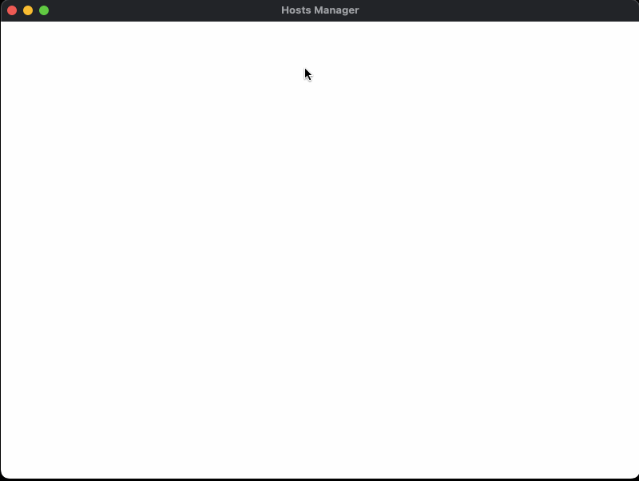

# Tauri Hosts Manager

This is a tiny tool for quick managing hosts file



## Permission

You may need to approve it once authentication dialog displayed, Since modifying hosts file require admin privileges.

## Download

- Mac 11.11+: [64bit](https://github.com/leftstick/hosts-high/releases/download/1.0.0/tauri-hosts-manager_1.0.0_x64.dmg.zip)

## How To Contribute

- clone repo first
- make sure you have [rust](https://www.rust-lang.org/) installed
- make sure you have [nodejs](https://nodejs.org/) installed

```bash
pnpm i
pnpm tauri dev
```

## LICENSE

[mit license]: https://raw.githubusercontent.com/leftstick/tauri-hosts-manager/master/LICENSE
[david-url]: https://david-dm.org/leftstick/tauri-hosts-manager.png
